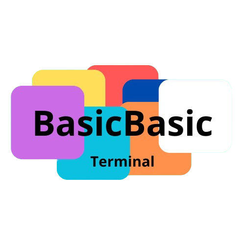

  

# BasicBasic

## O que é: 
- BasicBasic é um terminal focado na programação, resumindo: para programadores.

- O BasicBasic é bom para programadores pois tem compilador de **Python**, **C++**, e **Java**.

- Nele tem como usar o **Git Commit**, **Git Status**, **Git Clone** e **Git Push**.

## Funcionalidades:
- Criar pastas
- Criar arquivos
- Ver informações do computador
- Poder usar o tasklist
- Poder usar o Dir
- Ter o modo escuro e o modo claro
- Compilar codigos
- etc.

## Ajuda: 
  Use: ``Ajuda`` ou ``Help`` para ver todos os comandos e suas funcionalidades.

## Dispositivos: 
 APENAS WINDOWS!
 
## Baixar: 
  <a href="BasicBasic.exe" download>Baixar em .exe</a>
  
  <a href="BasicBasic.cpp" download>Baixar em .cpp</a>

    

  <h1>RECOMENDAVEL BAIXAR O .exe!</h1>

## Lançamento: 
  - Iniciado em 29/01/2025.
  - Lançado em 31/01/2025.
    
## Guia de comandos:
  - ``cpp Main`` - Executa o arquivo Main.cpp.
  - ``java Main`` - Executa o arquivo Main.java/class.
  - ``py Main`` - Executa o arquivo Main.py.
  - ``html Main`` - Executa o arquivo Main.html.
  - ``htm Main`` - Executa o arquivo Main.htm.

  se você quiser ir no jeito TRADICIONAL, use ``def.script cpp*`` para definir um script, dai você coloca o nome do arquivo quando executar o comando, dai você poderá compilar usando o comando: ``init.compile.script cpp``, se quiser trocar a versão, você pode trocar o "cpp" para **py** ou **java**.

  Você pode usar o terminal (Prompt De Comandos / cmd) usando os comandos: 

  - ``othe.cmd*`` - Imita o terminal uma vez.
  - ``other.cmd-loop*`` - Imita o terminal em loop (digite stop para sair do terminal).
  - ``other.cmd-diret*`` - Deixa você executar o terminal apenas pelo codigo, exemplo: ``other.cmd-diret*echo Hello, World!`` - Irá aparecer um texto escrito: "Hello, World!".

  Você pode ver o valor de uma string usando o comando: 

  - ``Show`` - Mostra o valor de uma string.

  Exemplo: 

  ``Show.defscriptCPP`` - Mostra o valor da string defscriptPYTHON (o nome do arquivo que eu defini).

  Você pode trocar a cor do terminal usando esse comando: 
  - ``Color`` - Troca a cor.

  Exemplos:

  ``Color A`` - Muda a cor para verde.

  ``Color 7`` - Muda a cor para padrão.

  Você pode selecionar se quer o modo escuro ou o modo claro no terminal, basta usar esses comandos: 

  ``darkmode`` - Modo escuro.

  ``lightmode`` - Modo claro.
## Creditos: 
  
  IDE: **Visual Studio Code.**
  
  Linguagem de programação: **C++.**
  
  Criador: **Thiago Bel.**
